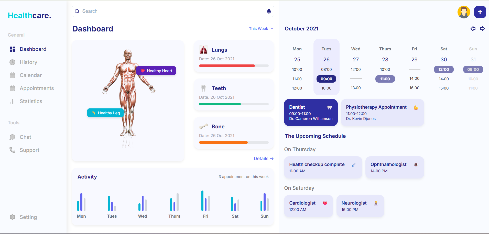

# 🏥 Healthcare Dashboard

A fully responsive, pixel-perfect **Healthcare Dashboard** built with **React**. This project demonstrates clean component architecture, modular styling, and mock data-driven rendering.

## 📸 Preview



---

## 🚀 Live Demo

Hosted on: [https://healthcare-dashboard-ui.netlify.app](https://healthcare-dashboard-ui.netlify.app)

---

## 📁 Features

- Responsive design across desktop, tablet, and mobile
- Static data rendered using React props
- Clean and professional healthcare-themed UI
- Modular, reusable component structure
- Pixel-perfect implementation from Figma/image design
- No interactivity or state management (static UI only)

---

## 📦 Tech Stack

- ⚛  **React** (with Create React App)
- 🎨 **CSS** (Modular or Global CSS)
- 🧩 **Lucide React** (for icons)
- 📁 **Static JS Objects** for mock data
- 📱 **Responsive Layouts** using Flexbox & CSS Grid
- 🌍 **Deployed on**: [Netlify](https://app.netlify.com/)

---

## 📁 Folder Structure

```bash
src/
├── assets/ # Icons, anatomy image, avatars
├── components/ # React component files
│ ├── Sidebar
│ ├── LeftPanel/
│ ├── RightPanel/
│ └── DashboardMainContent
├── data/ # Static mock data (calendarData, appointments, healthStatus)
├── styles/ # Component-specific CSS
├── App.css # Global CSS
├── App.js
├── index.css
├── index.js
└── README.md
```
---

## 🧩 Component Breakdown

| Component                | Responsibility                                             |
|--------------------------|------------------------------------------------------------|
| `App.js`                 | Layout controller (Sidebar + MainContent)                 |
| `Sidebar`                | Fixed nav with grouped links                              |
| `DashboardMainContent`   | Houses `LeftPanel` and `RightPanel`                      |
| `LeftPanel`              | Contains search bar, anatomy section, status, activity   |
| `RightPanel`             | Contains calendar and upcoming schedule                  |
| `AnatomySection`         | Image + health indicators                                 |
| `HealthStatusCards`      | Mock progress cards (lungs, bone, teeth)                 |
| `CalendarView`           | Time slots per weekday (responsive grid/flex)            |
| `SimpleAppointmentCard`  | Reusable schedule block                                  |
| `ActivityFeed`           | Static bar chart visualization                           |

---

## 🛠️ How to Run Locally

```bash
# 1. Clone the repo
git clone https://github.com/mahak-23/healthcare-dashboard.git
cd healthcare-dashboard

# 2. Install dependencies
npm install

# 3. Run development server
npm run dev    # or `npm start` if using CRA

# 4. Open in browser
http://localhost:3000
```
